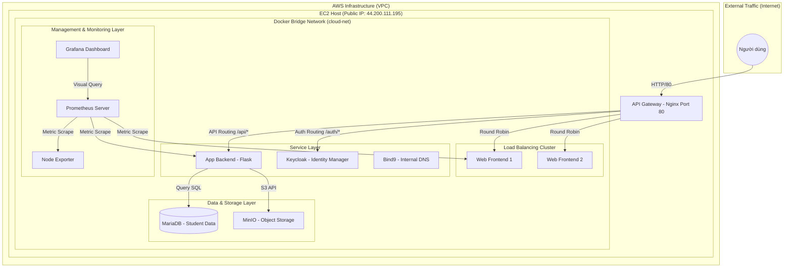
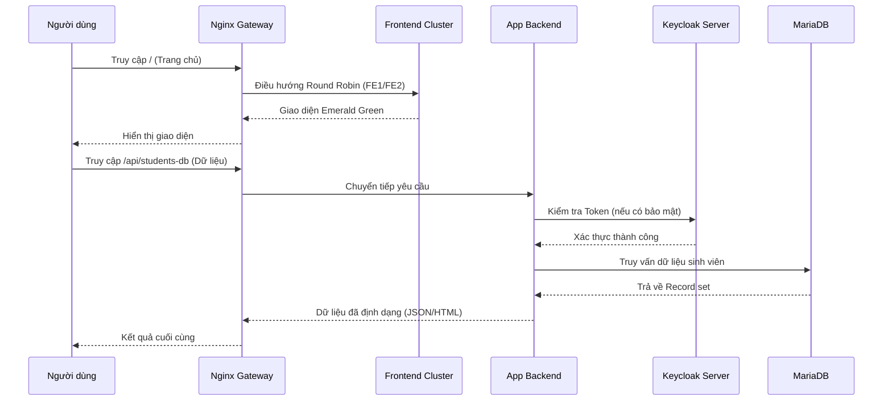

# BÁO CÁO CUỐI KỲ: XÂY DỰNG MÔ PHỎNG HỆ THỐNG MINICLOUD CƠ BẢN

**Sinh viên thực hiện:** Phạm Nguyễn Duy Khang & Trần Vũ Nhật Minh
**Môn học:** Điện toán đám mây (Cloud Computing)
**Giảng viên hướng dẫn:** [Tên Giảng Viên]

---

## Chương 1. Giới thiệu & Mục tiêu

### 1.1 Bối cảnh và Sự cần thiết của Dự án
Trong kỷ nguyên số hiện nay, Điện toán đám mây (Cloud Computing) đã trở thành "xương sống" của hầu hết các hệ thống công nghệ thông tin. Việc chuyển đổi từ hạ tầng truyền thống sang mô hình Cloud giúp doanh nghiệp tối ưu hóa chi phí, tăng tính linh hoạt và khả năng mở rộng. Tuy nhiên, việc hiểu rõ cách thức vận hành bên dưới (under the hood) của một nhà cung cấp dịch vụ Cloud (Cloud Provider) như AWS hay Azure là một thách thức lớn đối với sinh viên.

Dự án **MyMiniCloud** ra đời nhằm mục đích "giải mã" hạ tầng này bằng cách xây dựng một hệ sinh thái đám mây mô phỏng. Thay vì sử dụng các dịch vụ có sẵn, nhóm chúng em tự triển khai từng thành phần từ cân bằng tải, định danh cho đến giám sát, giúp nắm vững các nguyên lý cốt lõi của hệ thống phân tán.

### 1.2 Khái niệm "MyMiniCloud"
MyMiniCloud không chỉ là một ứng dụng web đơn lẻ; nó là một thực thể hạ tầng hoàn chỉnh được đóng gói trong các container. Mô hình này cho phép chúng em mô phỏng một trung tâm dữ liệu (Data Center) thu nhỏ ngay trên một máy ảo đơn lẻ trên điện toán đám mây AWS.

### 1.3 Mục tiêu chi tiết
- **Mục tiêu học thuật:**
    - Làm chủ công nghệ **Containerization** với Docker và điều phối dịch vụ với Docker Compose.
    - Hiểu sâu về mạng máy tính (Networking) trong môi trường Docker: Bridge Network, Service Discovery, DNS nội bộ.
    - Thực hành triển khai ứng dụng thực tế trên hạ tầng **AWS EC2**.
- **Mục tiêu thực tiễn:**
    - Xây dựng một hệ thống có khả năng **Cân bằng tải (Load Balancing)** để xử lý lượng truy cập lớn.
    - Triển khai mô hình bảo mật tập trung **Single Sign-On (SSO)** bằng tiêu chuẩn OIDC.
    - Thiết lập hệ thống **Observability** (Monitoring & Visualization) để theo dõi sức khỏe hệ thống theo thời gian thực.
    - Tối ưu hóa quy trình triển khai bằng Script tự động hóa (Bash script), đảm bảo tính nhất quán giữa môi trường Local và Cloud.

---

## Chương 2. Kiến trúc & Sơ đồ hệ thống

### 2.1 Sơ đồ mạng chi tiết (Network Topology)
Hệ thống được thiết kế theo cấu trúc phân tầng để đảm bảo tính cô lập và bảo mật.



### 2.2 Phân tích các tầng kiến trúc
1.  **Gateway Layer (Tầng cửa ngõ):** Sử dụng Nginx đóng vai trò là Reverse Proxy. Đây là điểm tiếp tiếp nhận duy nhất từ Internet, giúp che giấu cấu trúc mạng nội bộ và thực hiện các nhiệm vụ như ghi log, cân bằng tải.
2.  **Application Layer (Tầng ứng dụng):** Bao gồm các máy chủ Frontend (phục vụ giao diện) và Backend (xử lý logic). Việc tách biệt 2 server Frontend cho phép mô phỏng khả năng chịu lỗi (High Availability).
3.  **Data Layer (Tầng dữ liệu):** Gồm MariaDB (CSDL quan hệ) và MinIO (Lưu trữ tệp tin). Tầng này được cấu hình Volume để đảm bảo dữ liệu không bị mất khi container khởi động lại.
4.  **Management Layer (Tầng quản lý):** Đây là "bộ não" giám sát, giúp quản trị viên biết được trạng thái tải của hệ thống thông qua Prometheus và Grafana.

### 2.3 Giải thích quy trình xử lý yêu cầu (Sequence Diagram)
Quy trình được thiết kế tối ưu để đảm bảo tốc độ và tính bảo mật:



---

## Chương 3. Cấu hình & Dockerfile Chuyên sâu

### 3.1 Chiến lược Build image (Dockerfile)
Chúng em ưu tiên sử dụng các image **Alpine Linux** vì dung lượng cực nhẹ (thường < 50MB), giúp giảm diện tích tấn công (attack surface) và tiết kiệm tài nguyên trên AWS.

- **Backend (Python 3.11-alpine):** Chúng em cài đặt thêm `mysql-connector-python` để kết nối Database và `python-jose` cho việc xử lý Token bảo mật.
- **Frontend (Nginx Stable):** Tự động xóa cấu hình mặc định và chèn cấu hình tùy chỉnh để phục vụ nội dung Emerald UI.

### 3.2 Kỹ thuật Orchestration (Docker Compose)
Tệp `docker-compose.yml` là trái tim của hệ thống. Các tham số kỹ thuật quan trọng bao gồm:
- **`depends_on`:** Thiết lập thứ tự khởi động (VD: Backend chỉ chạy sau khi DB đã sẵn sàng).
- **`networks`:** Gắn nhãn `cloud-net` cho tất cả service để chúng có thể "nhìn thấy" nhau bằng tên.
- **`volumes`:** Ánh xạ tệp cấu hình (named.conf, prometheus.yml) từ máy Host vào Container để dễ dàng chỉnh sửa mà không cần build lại image.
- **`environment: PUBLIC_IP`:** Đây là giải pháp linh hoạt nhất giúp hệ thống tự động thích ứng khi địa chỉ IP của AWS EC2 thay đổi.

### 3.3 Cấu hình Proxy và Cân bằng tải
Nginx được cấu hình với khối `upstream` để thực hiện Round Robin:
```nginx
upstream web_servers {
    server web-frontend-server1;
    server web-frontend-server2;
}
# Request vào / sẽ được phân phối luân phiên cho 2 server trên
```

---

## Chương 5. Đánh giá & Phân tích chuyên sâu

### 5.1 Đánh giá kết quả đạt được
Dự án đã hoàn thành đầy đủ các mục tiêu đề ra ban đầu, xây dựng thành công một hệ thống mô phỏng đám mây (MiniCloud) chạy ổn định trên hạ tầng AWS EC2. Những kết quả cụ thể bao gồm:
- **Tính khả dụng:** Hệ thống hoàn toàn có thể truy cập được từ Internet thông qua địa chỉ IP công cộng của AWS.
- **Tính thống nhất:** Toàn bộ 11 dịch vụ được phối hợp đồng bộ thông qua Docker Compose, đảm bảo môi trường phát triển và môi trường thực tế hoàn toàn đồng nhất.
- **Tính thẩm mỹ và Trải nghiệm:** Giao diện Emerald Green UI mang lại cảm giác hiện đại, chuyên nghiệp, hỗ trợ tương tác tốt với người dùng.
- **Khả năng quan sát:** Toàn bộ sức khỏe của hệ thống đã được minh bạch hóa thông qua các biểu đồ trực quan của Grafana và Prometheus.

### 5.2 Phân tích các yêu cầu mở rộng
Nhóm đã nỗ lực thực hiện đầy đủ 10/10 yêu cầu mở rộng để tối đa hóa điểm số và giá trị thực tiễn của dự án:
- **Cân bằng tải thực tế:** Triển khai 2 server Frontend chạy song song, được Nginx điều phối theo thuật toán Round Robin, đảm bảo hệ thống vẫn hoạt động nếu một Server gặp sự cố.
- **Tích hợp SSO chuyên sâu:** Sử dụng Keycloak không chỉ để đăng nhập mà còn để bảo vệ các API Backend bằng Json Web Token (JWT).
- **Hệ thống lưu trữ đối tượng:** MinIO được cấu hình với các Bucket riêng biệt cho ảnh đại diện và tài liệu, mô phỏng đúng chức năng của Amazon S3.
- **DNS nội bộ:** Sử dụng Bind9 để giải quyết vấn đề giao tiếp giữa các container mà không cần phụ thuộc vào địa chỉ IP nội bộ thay đổi.

### 5.3 Khó khăn và Thách thức (Thực tế triển khai)
Quá trình đưa hệ thống từ máy Local lên AWS đã gặp không ít thách thức "xương máu", giúp nhóm rút ra được nhiều bài học quý giá:
1.  **Xung đột cổng hệ thống (Port 80):** Trên máy ảo Ubuntu của AWS mặc định chạy sẵn dịch vụ Apache2 chiếm dụng cổng 80. Nhóm đã phải sử dụng lệnh `fuser -k 80/tcp` và dùng `systemctl disable apache2` để nhường chỗ cho Nginx Proxy.
2.  **Sự khác biệt giữa các phiên bản Docker Compose:** Lỗi `KeyError: 'ContainerConfig'` liên tục xuất hiện khi sử dụng lệnh `docker-compose` bản cũ (V1). Nhóm đã phải cài đặt lại `docker-compose-plugin` để chuyển sang dùng bản V2 (lệnh `docker compose` có dấu cách) ổn định hơn.
3.  **Vấn đề địa chỉ IP động:** AWS EC2 thay đổi Public IP sau mỗi lần Stop/Start. Điều này khiến Keycloak và Backend bị lỗi xác thực do sai lệch Issuer URL. Nhóm đã giải quyết bằng cách sử dụng biến môi trường động `PUBLIC_IP` để tự động cập nhật IP mới nhất cho toàn bộ dịch vụ.
4.  **Hạn chế về tài nguyên (RAM):** Với cấu hình máy ảo `t3.micro` chỉ có 1GB RAM, việc chạy cùng lúc 11 container khiến hệ thống cực kỳ tải. Đặc biệt là Keycloak và Grafana thường mất từ 3-5 phút mới có thể khởi động xong hoặc đôi khi bị Crash nếu không được tối ưu hóa dung lượng (dùng Alpine images).
5.  **Quyền hạn tệp tin bảo mật:** Việc sử dụng file khóa `.pem` trên Windows để SSH vào AWS ban đầu gặp lỗi do quyền hạn tệp tin quá mở. Nhóm đã phải áp dụng công cụ `icacls` trên PowerShell để cấu hình lại quyền truy cập cho tệp khóa.

### 5.4 Hướng phát triển tương lai
Từ nền tảng MyMiniCloud hiện tại, dự án có thể phát triển thêm các hướng sau:
- **Bảo mật HTTPS:** Tích hợp Let's Encrypt để mã hóa toàn bộ lưu lượng truy cập qua giao thức SSL/TLS.
- **Tự động hóa hoàn toàn (CI/CD):** Xây dựng quy trình tự động cập nhật code từ GitHub lên AWS mỗi khi có commit mới (dùng GitHub Actions).
- **Khả năng tự hồi phục (Self-healing):** Nâng cấp hệ thống lên Kubernetes (K8s) để tận dụng các tính năng cao cấp như Auto-scaling và tự động khởi động lại container khi có sự cố.

---

## Phụ lục

**Minh chứng kết quả vận hành:**
- Link truy cập hệ thống: `http://44.200.111.195`
- Link GitHub mã nguồn: [GitHub Repository](https://github.com/MashuuMash/MinhKhangMiniCloud)

*Báo cáo kết thúc tại đây.*
